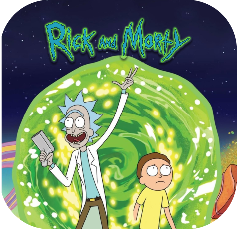
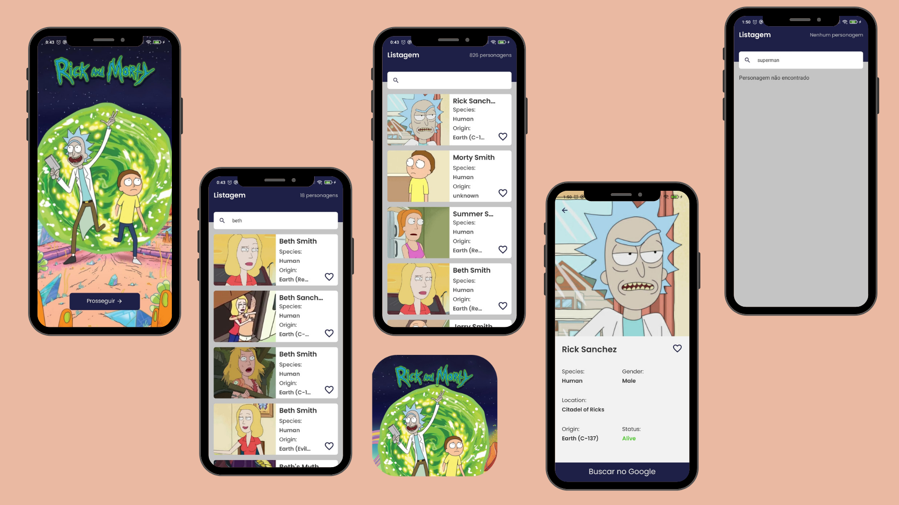

<div align="center"></div>

# Rick and Morty 🛸
#### Projeto que apresenta todos os personagens da série animada Rick and Morty, onde você poderá saber informações e favoritar seus persosagens favoritos.




#### Figma
 [link](https://www.figma.com/file/k0tx8AoKkpVnqD6asoeTCp/Rick-and-Morty-app)

### 🧪 Tecnologias Utilizadas
- React Native
- Typescript
- Styled-component
- Async Storage
- React Navigation
- UseContext
 
## 🚀 Como usar

#### clonar o repositório
```bash
git clone https://github.com/Gabriela-Leite/RickAndMorty.git
```

#### instalar as dependências
```bash
npm install
```

#### rodando o projeto
```bash
npx react-native start --reset-cache
```
e
```bash
npx react-native run-android
```


##### Opa, bom dia ☀️ por Gabriela Miranda
